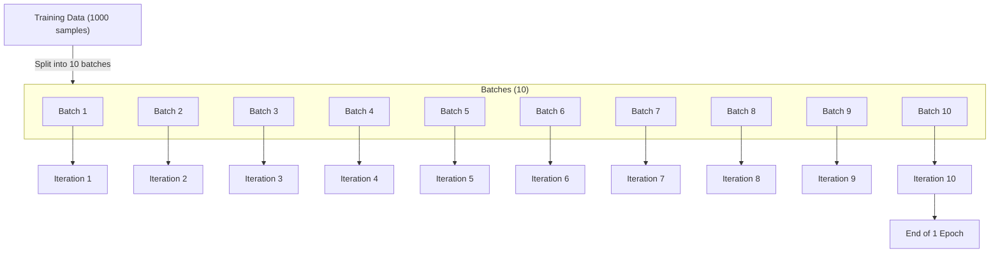

```mermaid
flowchart TD
    A["Training Data (1000 samples)"]
    subgraph Batches["Batches (10)"]
      direction LR
      B1["Batch 1"]
      B2["Batch 2"]
      B3["Batch 3"]
      B4["Batch 4"]
      B5["Batch 5"]
      B6["Batch 6"]
      B7["Batch 7"]
      B8["Batch 8"]
      B9["Batch 9"]
      B10["Batch 10"]
    end
    A -->|Split into 10 batches| Batches
    B1 --> I1["Iteration 1"]
    B2 --> I2["Iteration 2"]
    B3 --> I3["Iteration 3"]
    B4 --> I4["Iteration 4"]
    B5 --> I5["Iteration 5"]
    B6 --> I6["Iteration 6"]
    B7 --> I7["Iteration 7"]
    B8 --> I8["Iteration 8"]
    B9 --> I9["Iteration 9"]
    B10 --> I10["Iteration 10"]
    I10 --> E["End of 1 Epoch"]
```